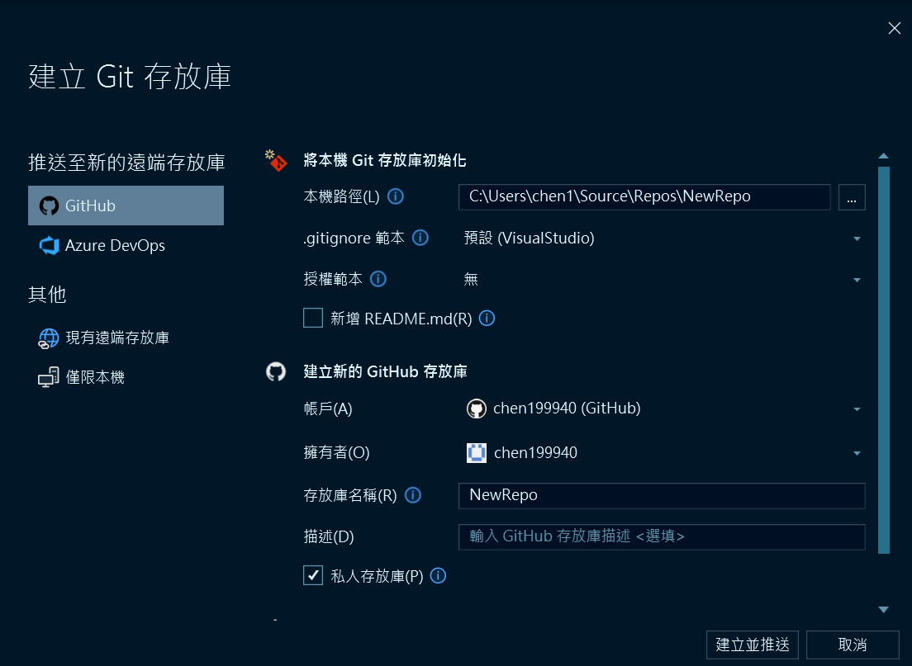
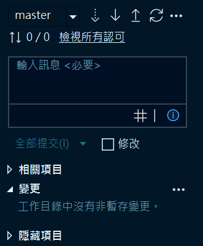

# github上傳筆記
這份教學將教你如何將程式碼上傳至GitHub，讓你可以輕鬆管理你的程式專案和筆記。
## 於GitHub建立Repository(儲存庫)
1. 首先，在Visual Studio右下角，建立Git存放庫，用來存放你的程式碼和筆記。
> 
2. 主要本機路徑要指向你存放程式的資料夾位置，存放庫名稱要修改。
> 
3. 最後按下「建立並推送」就成功建立 Github 儲存庫
## 還要上傳檔案的話
1. 按下「同步(提取後推送)」
> 
2. 在「輸入訊息<必要>」輸入文字，再按下「全部提交」
3. 最後按下「推送」就成功上傳檔案至 Github 儲存庫
