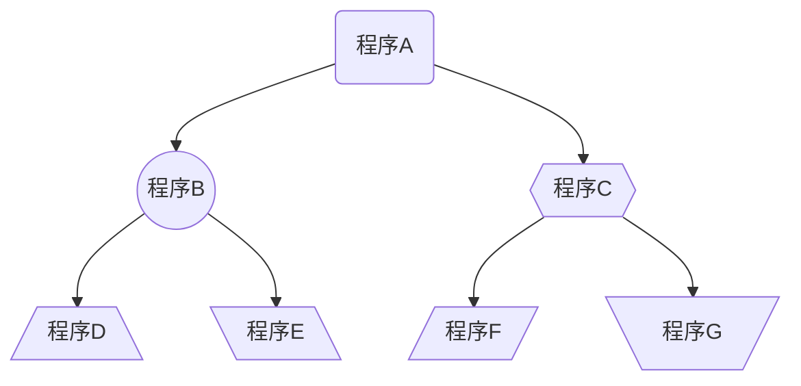

# <p align="center">Mermaid語法設計指南</p>
基於文本的繪圖工具，通過簡單的文本描述，可以快速生成各種圖表，如流程圖、序列圖、甘特圖等。
使用Mermaid語法時，最前加上一行「\`\`\``mermaid`」表示程式開始，最後再加上一行「\`\`\`」表示程式結束。
並且適用於多種文本編輯器和環境。
## <p align="center">流程圖</p>
### <p align="center">定義方向</p>
以 `graph` 為開頭，宣告圖表方向，可以表示四種相對的方向：
* `TB/TD` 上到下
* `BT` 下到上
* `RL` 右到左
* `LR` 左到右
### <p align="center">定義圖形</p>
- `id1[方框]`：表示一個方框。
- `id2(帶有圓角的方框)`：表示一個帶有圓角的方框。
- `id3([體育場形狀])`：表示一個體育場形狀的圖形。
- `id4[[子例程]]`：表示一個子例程的圖形。
- `id5[(圓柱狀)]`：表示一個圓柱形狀的圖形。
- `id6((圓形))`：表示一個圓形。
- `id7>非對稱形狀]`：表示一個非對稱形狀的圖形。
- `id8{菱形}`：表示一個菱形。
- `id9{{六角形}}`：表示一個六角形。
- `id10[/平行四邊形1/]`：表示一個平行四邊形。
- `id11[\平行四邊形2\]`：表示另一種平行四邊形。
- `id12[/梯形1\]`：表示一種梯形。
- `id13[\梯形2/]`：表示另一種梯形。
### <p align="center">繪製流程圖</p>
可以使用CSS樣式對節點（圖表中的元素）進行自定義外觀設定
<p align="center">1. 文字展示</p>

```code
%%{init: {'nodeStyle': {'background-color': 'lightblue', 'color': 'black'}}}%%
graph TD;
    id2(程序A)-->id6((程序B));
    id2(程序A)-->id9{{程序C}};
    id6((程序B))-->id10[/程序D\];
    id6((程序B))-->id11[\程序E\];
    id9{{程序C}}-->id12[/程序F/];
    id9{{程序C}}-->id13[\程序G/];
```
<p align="center">2. 圖片展示</p>


## <p align="center">參考資源</p>
[認識 docsify 文件好幫手 mermaid，簡單畫出 Flowcharts](https://medium.com/unalai/%E8%AA%8D%E8%AD%98-docsify-%E6%96%87%E4%BB%B6%E5%A5%BD%E5%B9%AB%E6%89%8B-mermaid-%E7%B0%A1%E5%96%AE%E7%95%AB%E5%87%BA-flowcharts-3b1ac30b1ee1)
