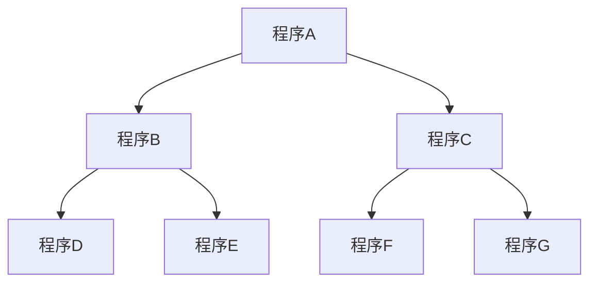

# Mermaid語法設計指南
使用Mermaid語法時，最前加上一行「\`\`\`mermaid」表示程式開始，最後再加上一行「\`\`\`」表示程式結束。  
## 定義方向
以 graph 為開頭，宣告圖表方向，可以表示四種相對的方向：
* **TB/TD** 上到下
* **BT** 下到上
* **RL** 右到左
* **LR** 左到右
## 定義圖形
||||
|:-----:|:------:|:------:|
| id1[方框]|id2(帶有圓角的方框)|id3([體育場形狀])|
|id4[[子例程]]|id5[(圓柱狀)]|id6((圓形))|
|id7>非對稱形狀]|id8{菱形}|id9{{六角形}}|
|id10[/平行四邊形1/]|id11[\平行四邊形2\]|
|id12[/梯形1\]|id13[\梯形2/]||
## 繪製流程

