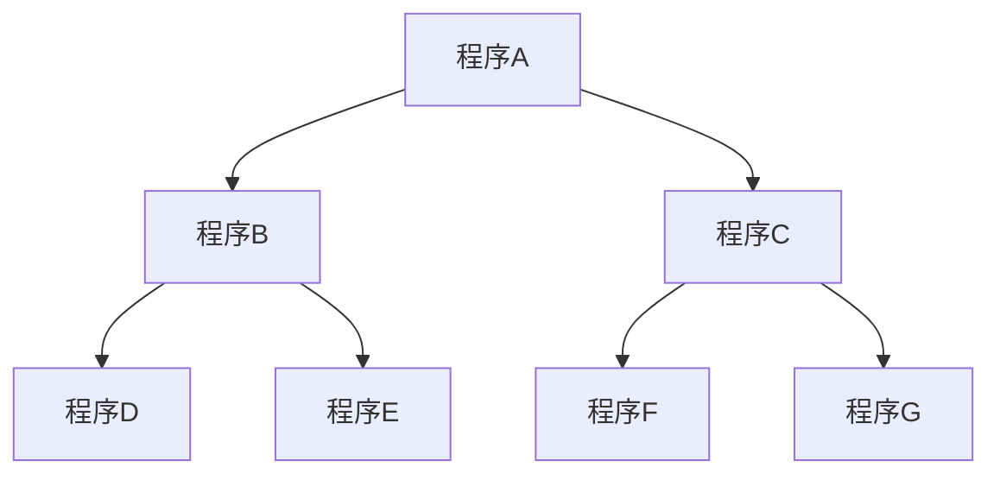

# <p align="center">Mermaid語法設計指南</p>
基於文本的繪圖工具，通過簡單的文本描述，可以快速生成各種圖表，如流程圖、序列圖、甘特圖等。
使用Mermaid語法時，最前加上一行「\`\`\``mermaid`」表示程式開始，最後再加上一行「\`\`\`」表示程式結束。
並且適用於多種文本編輯器和環境。
## <p align="center">流程圖</p>
### <p align="center">定義方向</p>
以 `graph` 為開頭，宣告圖表方向，可以表示四種相對的方向：
* `TB/TD` 上到下
* `BT` 下到上
* `RL` 右到左
* `LR` 左到右
### <p align="center">定義圖形</p>
|||||||
|-|-|-|-|-|-|
| id1[方框]|id2(帶有圓角的方框)|id3([體育場形狀])|id4[[子例程]]|id5[(圓柱狀)]|id6((圓形))|
|id7>非對稱形狀]|id8{菱形}|id9{{六角形}}|id10[/平行四邊形1/]|id11[\平行四邊形2\]|id12[/梯形1\]
|id13[\梯形2/]||||||
### <p align="center">繪製流程圖</p>
可以使用CSS樣式對節點（圖表中的元素）進行自定義外觀設定
1. 文字展示
```code
%%{init: {'nodeStyle': {'background-color': 'lightblue', 'color': 'black'}}}%%
graph TD;
    程序A-->程序B;
    程序A-->程序C;
    程序B-->程序D;
    程序B-->程序E;
    程序C-->程序F;
    程序C-->程序G;
```
2. 圖片展示

## <p align="center">參考資源</p>
[認識 docsify 文件好幫手 mermaid，簡單畫出 Flowcharts](https://medium.com/unalai/%E8%AA%8D%E8%AD%98-docsify-%E6%96%87%E4%BB%B6%E5%A5%BD%E5%B9%AB%E6%89%8B-mermaid-%E7%B0%A1%E5%96%AE%E7%95%AB%E5%87%BA-flowcharts-3b1ac30b1ee1)
