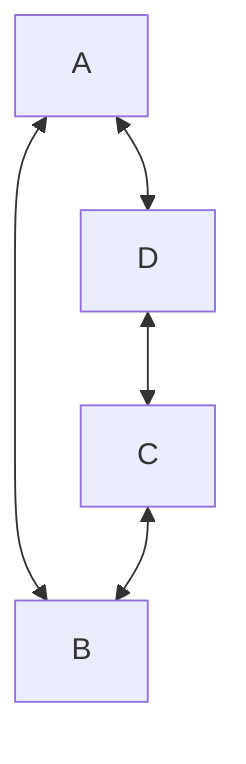
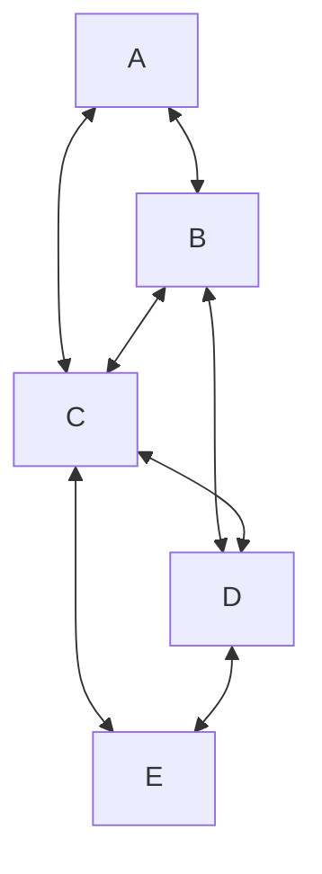
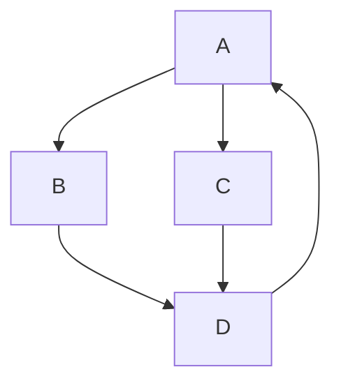

# <p align="center">圖形的表示法</p>
## <p align="center">鄰接矩陣（Adjacency Matrix）</p>
> 二維整數陣列，其中 i 行與 j 列，表示 i 到 j 的花費(或權重值、或單純表示連通)，為零表示不連通。

```markdown
    A B C D
  A 0 1 0 1
  B 1 0 1 0
  C 0 1 0 1
  D 1 0 1 0
```
## <p align="center">鄰接表（Adjacency List）</p>
> 每一個頂點相鄰的邊集的集合，常用於無向圖。

```markdown
A: B 、 C
B: A 、 C 、 D
C: A 、 B 、 D 、 E
D: B 、 C 、 E
E: C 、 D
```
## <p align="center">十字鏈結串列（Orthogonal Linked List）</p>
> 表示有向圖的資料結構，它結合了鄰接表和逆鄰接表的優點。每個頂點都有兩個鏈結串列，一個存儲所有的出邊，另一個存儲所有的入邊。這樣的設計可以高效地進行圖的遍歷和操作。

```markdown
頂點 A:
  出: B、C
  入: D

頂點 B:
  出: D
  入: A

頂點 C:
  出: D
  入: A

頂點 D:
  出: A
  入: B、C
```