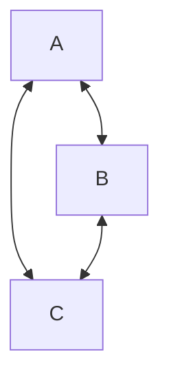
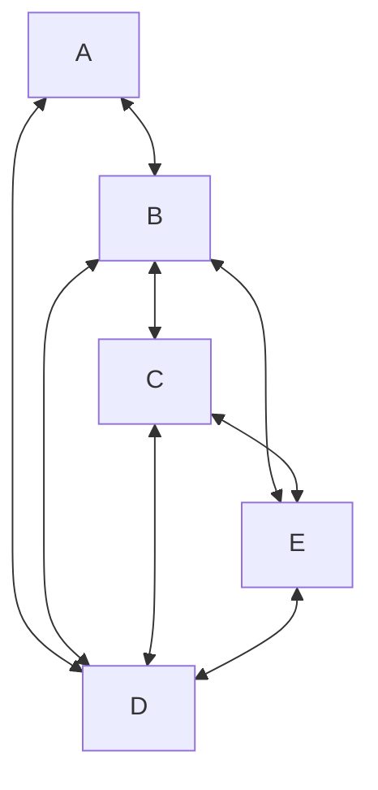

# 
圖形簡介

## 
尤拉環（Eulerian Circuit）

> 當所有頂點的分支度皆為偶數時，才能從某頂點出發，經過每一個邊一次，再回到其點。下圖為例，分支度 2 為偶數。

## 
尤拉鏈（Eulerian Path）

> 從頂點出發，經過每邊一次，不一定要回到起點，亦即只許其中兩個頂點的分支度是奇數，其餘全部為偶數。下圖為例，C、E 分支度為奇數，其餘分支度為偶數。

## 
名詞介紹

### 
分支度（Degree）

> 此點跟其他點之間連接的邊（Edge）的總數。
### 
頂點（Vertex）

> 圖之中的某一個節點